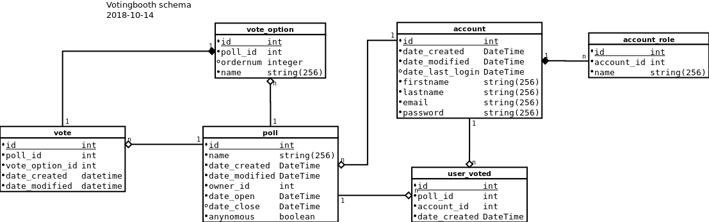

# Votingbooth
Need to vote on something? Step right up to the votingbooth and cast your vote. Are you doing your part?

## Overview

The votingbooth is a python web-application to create polls and vote in them. Votes can be cast either anonymously or as a registered user, but all cast votes are anonymous regardless of login status.

Checkout the app att <https://fgronqvist-votingbooth.herokuapp.com/> and the repo at <https://github.com/fgronqvist/votingbooth>

The specifications for the application is listed at <http://advancedkittenry.github.io/suunnittelu_ja_tyoymparisto/aiheet/Aanestys.html>. [Usecases](documentation/userstories.md), object-diagrams, database schema layouts and definitions will be added as the work progresses.

Check out the [documentation](documentation) for further details.

## Datastorage

The back-end data-storage is a Postgres database with a schema pictured below.

